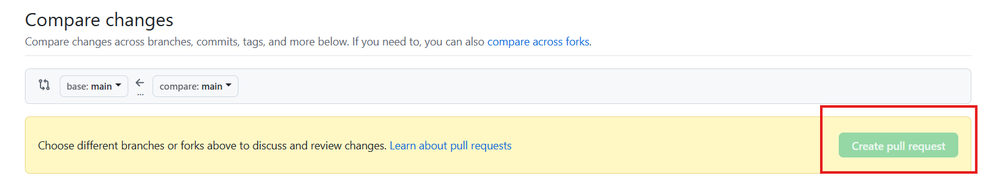

# 🔄 Fork & Pull Request 협업 가이드

이 저장소는 **Fork 후 Pull Request(PR)** 방식으로 협업을 진행합니다.

---

## 📌 Fork란?

> **Fork**는 원본 저장소를 자신의 GitHub 계정으로 **복제**하는 과정입니다.  
> Fork를 하면 **모든 커밋 기록과 함께** 원본 저장소가 내 저장소로 복사됩니다.

---

## 🛠️ 협업 절차

### 1. 저장소 Fork

- [원본 저장소](https://github.com/hyobin96/PCCP_Study.git)로 이동 후 `Fork` 버튼 클릭  
- 자신의 GitHub 계정에 저장소가 복제됨

---

### 2. Fork한 저장소를 로컬에 Clone

---

### 3. 원본 저장소 연결 (Upstream 추가)

- git remote add upstream https://github.com/hyobin96/PCCP_Study.git

---

### 4. 로컬에서 작업 후 Commit & Push

- git add .
- git commit -m "문제 풀이 업로드"
- git push origin main  # 또는 본인의 브랜치 이름

---

### 5. Pull Request 전에 원본 저장소 변경 사항 가져오기

- git fetch upstream

- 변경된 내용이 있다면 로컬 브랜치에 merge:

- git merge upstream/main

---

### 6. 충돌(conflict) 발생 시 해결 후 Merge

- 충돌이 생기면 해결한 뒤 merge 후 계속 진행

---

### 7. Pull Request(PR) 생성

- GitHub 웹에서 `Pull requests` 클릭

  

- New pull request 클릭

  

- 변경 내용을 확인하고, 설명을 작성한 후 `Create pull request` 버튼 클릭

  

---

## ✅ 요약 명령어

| 단계              | 명령어 |
|------------------|--------|
| 원본 저장소 연결 | `git remote add upstream https://github.com/hyobin96/PCCP_Study.git` |
| 원본 fetch       | `git fetch upstream` |
| 변경 사항 병합   | `git merge upstream/main` |
| 푸시             | `git push origin main` |
| PR 생성          | GitHub 웹에서 Pull Request 요청 |

---

> 💡 항상 PR 전에 `git fetch upstream`을 통해 최신화하고, 충돌 여부를 반드시 확인하세요.